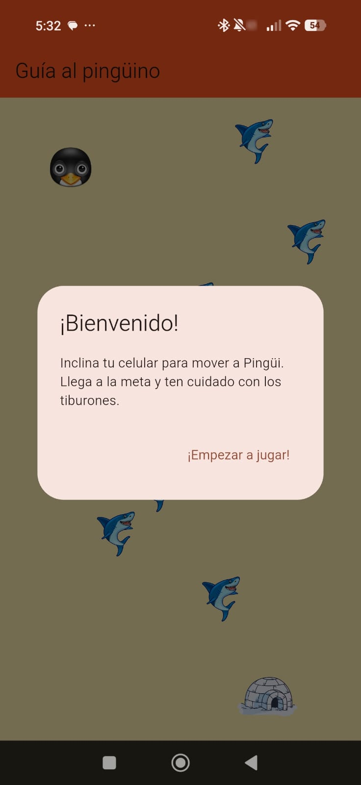
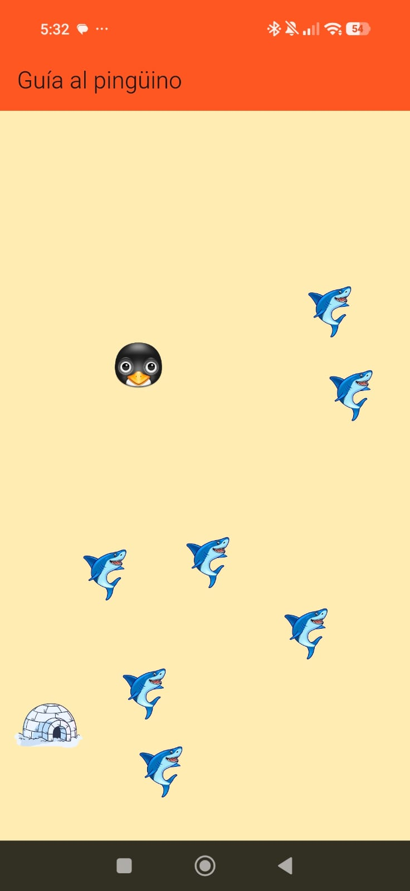
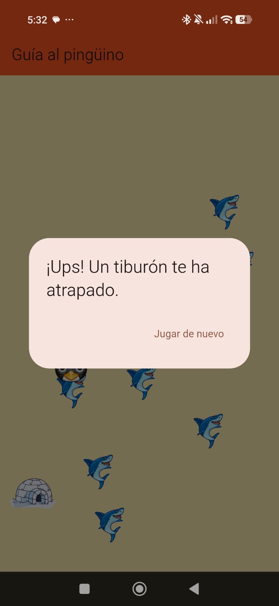
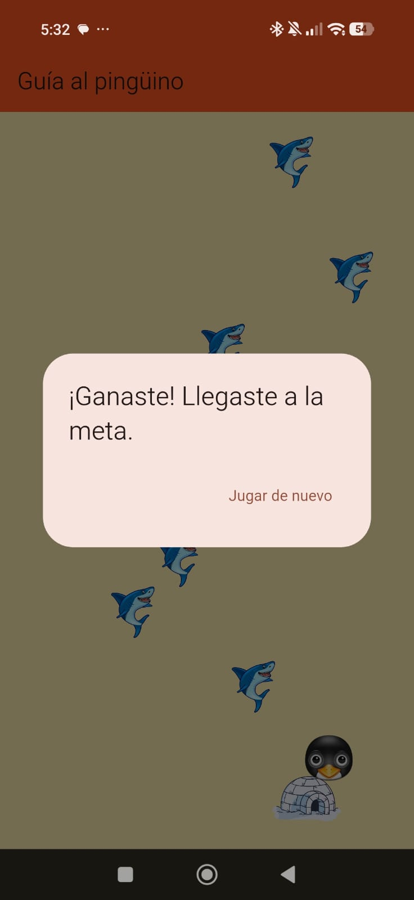

# 🐧 Juego del Pingüino con Acelerómetro

Un minijuego interactivo desarrollado en Flutter que pone a prueba tu pulso y destreza utilizando los sensores (acelerómetro) de tu teléfono.

## 🎮 ¿De qué trata?

El objetivo del juego es simple pero desafiante: debes guiar a "Pingüi" desde el punto de inicio hasta la meta, inclinando físicamente tu dispositivo celular. 

**¿Cómo funciona?**
* **Movimiento real:** El juego lee constantemente los datos del acelerómetro en los ejes X e Y para calcular la inclinación del teléfono y mover al personaje en esa dirección.
* **Niveles únicos:** Cada vez que juegas, la posición de la meta y de los obstáculos (los tiburones) se genera de forma aleatoria, por lo que cada partida es un laberinto distinto.
* **Física de colisión:** Tienes que ser muy preciso, si el pingüino toca a un tiburón, pierdes inmediatamente.

## 📸 Capturas de Pantalla

-  — Imagen 0: Pantalla de inicio esperando a empezar.
-  — Imagen 1: Captura del pingüino esquivando a los tiburones.
-  — Imagen 2: Captura del momento en que un tiburón te atrapa.
-  — Imagen 3: Captura al lograr llegar a la meta.

## 🛠️ Tecnologías Usadas
* [Flutter](https://flutter.dev/)
* Paquete [sensors_plus](https://pub.dev/packages/sensors_plus) para la lectura del hardware.

## 📱 Cómo ejecutarlo en tu máquina
1. Clona este repositorio: `git clone https://github.com/Alexis-Eusebio/juego_acelerometro.git`
2. Instala las dependencias: `flutter pub get`
3. Conecta un dispositivo físico (recomendado para probar el acelerómetro) y ejecuta: `flutter run`